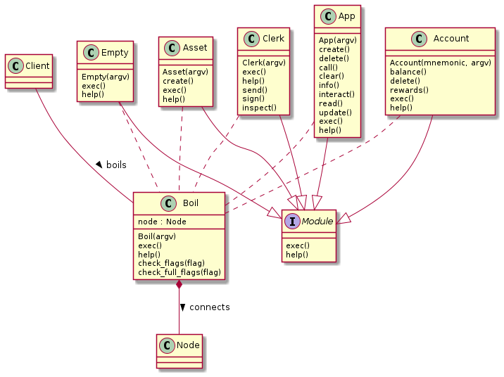

# Boil
a lightweight alternative goal command line to use with public nodes 

## Documentation
We take advantage of polymorphism to build a module system that executes commands
with arguements passed into cli



## Usage
```
Usage:
  boil [flags]
  boil [command]

Available modules:
  clerk         provides tools to perform transactions
  account       control and manage algorand accounts
  asset         manage assets
  app           manage applications

Flags:
  -v, --version     display version information
  -h, --help        help for boil
```
