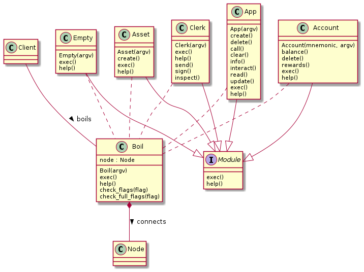

We take advantage of polymotphism to build a module system that executes commands with arguements given on the command line.

The Boil module composites the Node type so as to decouple selection of an active node.

